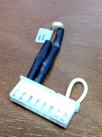
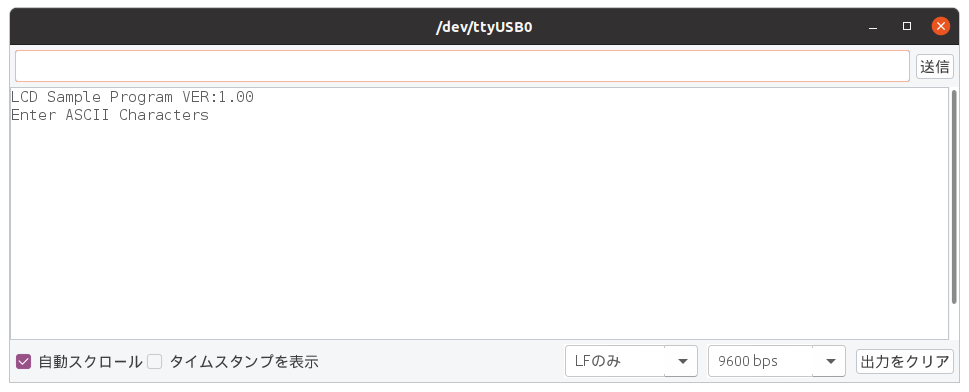
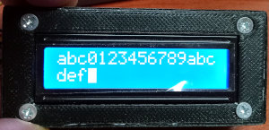

スマート農業塾 UECS NODE トレーニングキット01
===========================================

M302KにSHT3xを接続して温度湿度計測を行い、結果をUECS電文で送信する装置。

- Version: V045
- Release: 24-Nov-2021
- Develop: HOLLY&Co.,Ltd.

# 1. 必要なH/W

- Arduino UNO R3 互換機上等。ピン位置など物理形状は本家と同じにする
- M302K HOLLY製シールド基板
- SHT-31 温度湿度センサ
- W5500 NIC
- I2C I/F LCD 1602 (16桁2行)
- AC100/220V to DC5V/1.5A 電源
- プッシュスイッチ
- CdS (Option)  

# 2. M302Kとの配線

M302KはArduino UNOのシールドとして接続する。

# 3. ソフトウェアのインストール

## 3.1. 必要なライブラリ
- [Ethernet2](https://github.com/adafruit/Ethernet2)
- [Adafruit_BusIO](https://github.com/adafruit/Adafruit_BusIO)
- [Adafruit_SHT31](https://github.com/adafruit/Adafruit_SHT31)

## 3.2. EEPROMの初期値

この初期値設定は、Arduino UNO 単体で実行する。

EEPROMが壊れていなければ、再度初期化する必要はない。  
MACアドレスやUECSID,ROOM,REGIONなどの位置情報の初期値を設定する。

このプログラムは、lowcore サブディレクトリの配下にある。この lowcore.ino をArduino UNOに最初にインストールして初期値を作成する。  
詳細は、 [lowcore/README.md](lowcore/README.md) を参照の事。

## 3.3. 主プログラムのインストール

主プログラムは、main サブディレクトリの配下に全て含まれている。
それを Arduino IDE などでコンパイルしてCPUにupload(install)する。

## 3.4. 実習用のプログラム
### 3.4.1. ARITH4

四則演算を行う実習用のプログラムを収めている。
シリアルモニタを用いて、
XとYの値を入力するとそれらを用いた四則演算の結果をシリアルモニタに出力される。

### 3.4.2. LCDDISP

シリアルモニタから入力された文字をLCDに表示する実習用のプログラムを収めている。  

1. M302にLCDを接続する。
1. lcddisp.inoをコンパイルしてロードする。
1. シリアルモニタを開いて、キーボードから文字を入力する。シリアルモニタには、
  
と表示する。上のフィールドに文字を入力して[送信]ボタンをクリックする。
1. 文字を入力していくと、LCDに表示されていく。表示域からあふれると行を変えて表示を続ける。

# 4. 使い方

使い方は、取扱説明書を [main/MANUAL.md](main/MANUAL.md) に記すので、そちらを参照する。
まだ書かれていない。

# 5. 著作権

This software is released under the MIT License, see [LICENSE.txt](LICENSE.txt).  
(このソフトウェアは、MITライセンスのもとで公開されている。[LICENSE-ja.txt](LICENSE-ja.txt)を見よ。)
